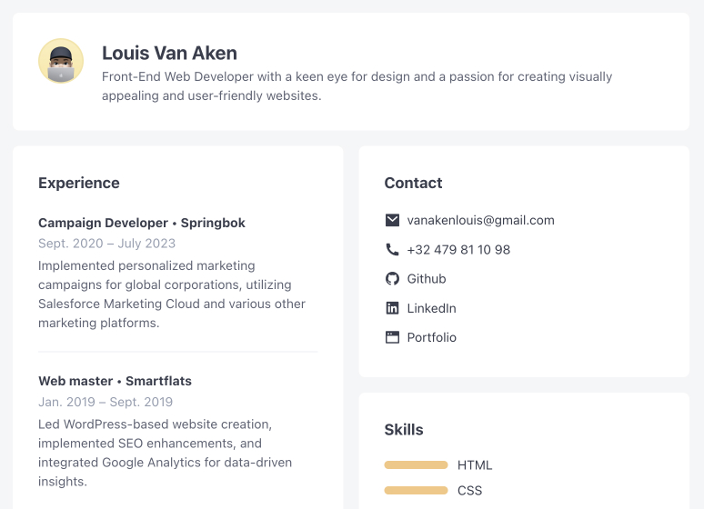

<!-- ABOUT THE PROJECT -->
# CV

A resume to show my skills and the projects I worked on to potential employers.

[View project live](https://louis-va.github.io/my-cv/)

## Description



A resume is a brief document summarizing a person's work experience, skills, education, and qualifications, used for job applications. Its purpose is to highlight an individual's suitability for a specific job and facilitate the hiring process.


## Built With

* Vite
* HTML
* CSS


<!-- GETTING STARTED -->
# Getting Started

## Prerequisites

You need to have node and npm installed on your machine to run this project locally.  

### npm
  ```sh
  npm install npm@latest -g
  ```

## Installation

### 1. Clone the repo
```sh
git clone git@github.com:louis-va/my-cv.git
```
### 2. Install NPM packages
```sh
npm install
```

## Execution 
```sh
npm run dev
```
